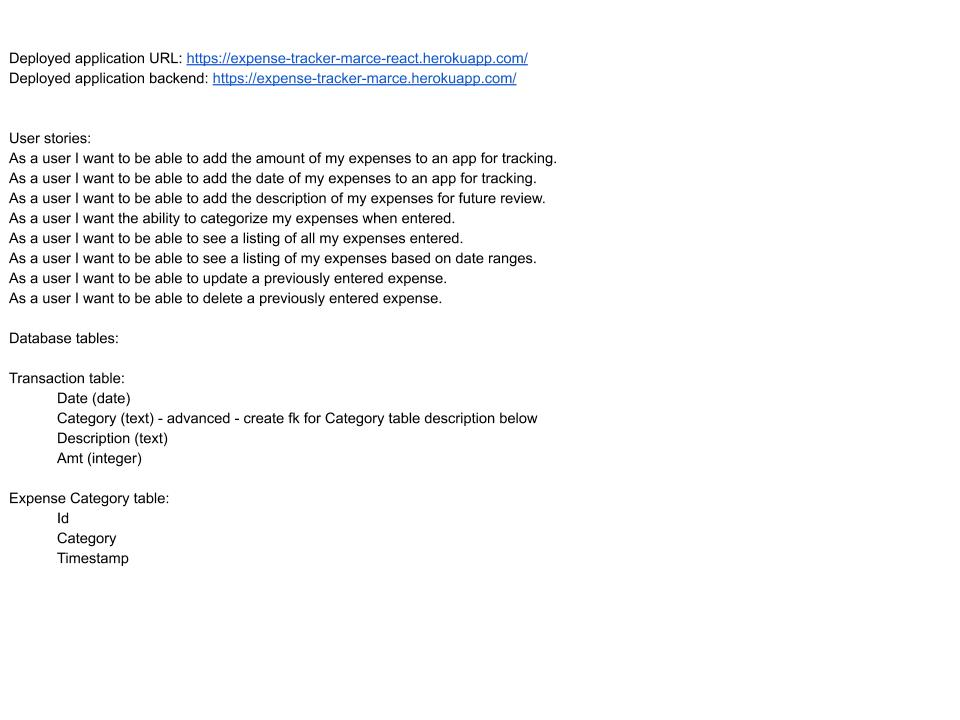

# Expense Tracker application URL for frontend
https://expense-tracker-marce-react.herokuapp.com/
# Expense Tracker application URL for backend
https://expense-tracker-marce.herokuapp.com/

# Technologies for this Build
React
Axios,
Flask,
Postgres,
Peewee,
chart.js,
semantic ui,
CSS

# React Components for front end code
AddExpenseModal
AppCharts
AppHeader
EditExpenseModal
ExpenseContainer
ExpenseList
SelectdatesModal

# Data Models for backend code
Expenses schema - for each transaction expense
Category schema - for expense categories

# Backend API's used in project
Calls the database to retrieve, add, update and delete expesenses.
https://expense-tracker-marce.herokuapp.com/api/v1/expenses/
Calls the database to retrieve expense categories
https://expense-tracker-marce.herokuapp.com/api/v1/categories/
 

# Additional features that I would like to add at a later date:
Budget versus spend information by month
Modelling to show what changes in spending would do to savings
Budgeting by category
User setups for app

# Lessons Learned
Started out using semantic ui from the beginning on this project since I liked the modal functioanlity that was used on an in class project.  I ran into a few issues
that really occupied a lot of my time trying to figure out a solution.  Spent a lot of time reading documentation to figure out one issue and the other I was assisted with.  Probably better to be more familiar with a tech stack from the beginning when working on a tight timeline.

# Approach:
Set out to build an expense tracker application that had several features.  Tracking transactions.  Being able to add, update and delete transactions. Searching transactions by date ranges and summing transactions by date ranges in order to see spending patterns by for an app user.  Really wanted to add a user schema to this application in order to track information by user in the database, but was not able to implement that feature in the timeframe.

# Functionality currently working on for future 
Add user schema, buget modelling to forcast savings based on changes in spending habits.

# User stories for Project 4 - Expense Tracker

User stories:
As a user I want to be able to add the amount of my expenses to an app for tracking,
As a user I want to be able to add the date of my expenses to an app for tracking,
As a user I want to be able to add the description of my expenses for future review,
As a user I want the ability to categorize my expenses when entered,
As a user I want to be able to see a listing of all my expenses entered,
As a user I want to be able to see a listing of my expenses based on date ranges,
As a user I want to be able to update a previously entered expense,
As a user I want to be able to delete a previously entered expense,

# Wire Frame Diagram

